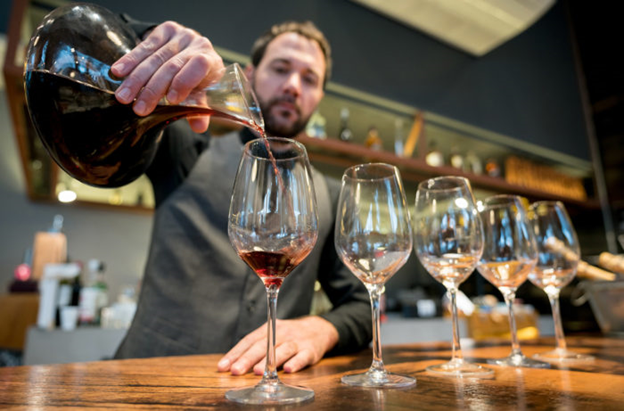
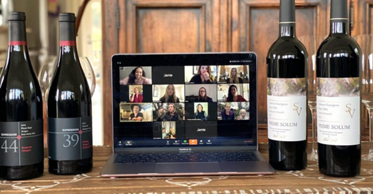
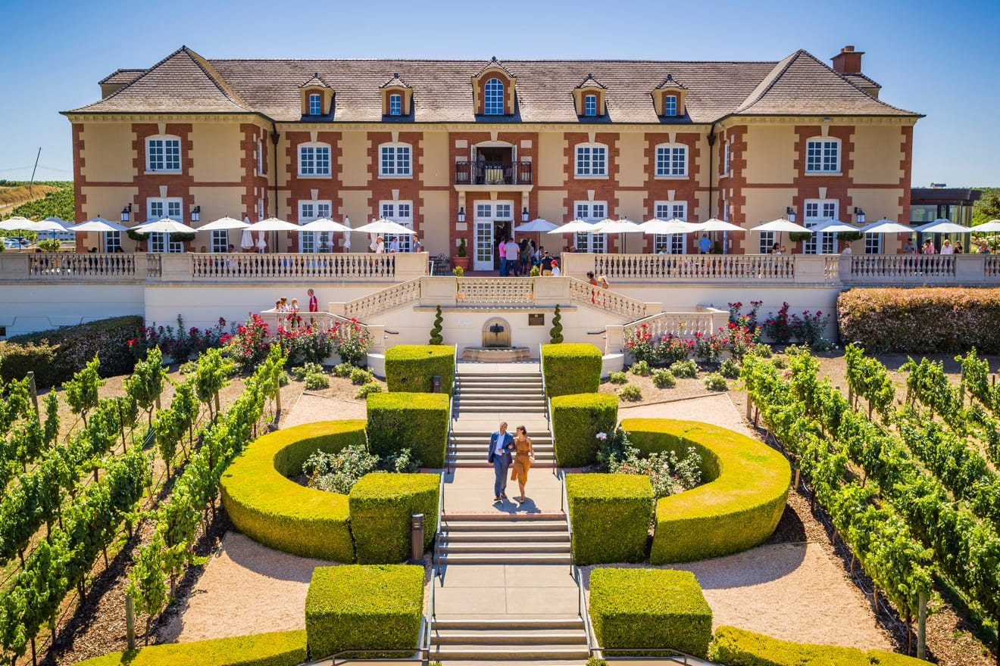
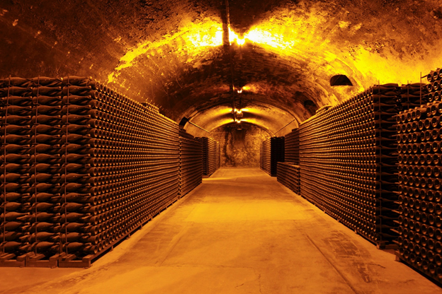

  
  #    
  

# Final Project - Vine & Vault

                          

## Table of Contents
* [Presentation](#Presentation) 
    * [Predictive Wine Ratings](#Predictive-Wine-Ratings) 
    * [Technologies Used](#Technologies-Used) 
          *  [Data Cleaning and Analysis](#Data-Cleaning-And-Analysis) 
          *  [Database Storage](#Database-Storage) 
          *  [Machine Learning](#Machine-Learning) 
          *  [Dashboard](#Dashboard) 
          *  [Final Project Website](#Final-Project-Website) 
* [Database](#Database)     
    * [Dataset](#Dataset)          
* [Machine Learning Model](#Machine-Learning-Model) 
    * [Question we would like to answer with our machine learning model](#Question-we-would-like-to-answer-with-our-machine-learning-model) 
    * [Machine Learning Model](#Machine-Learning-Model) 
    * [Output Label](#Output-Label) 
    * [Model Accuracy](#Model-Accuracy) 
    * [Data Preprocessing](#Data-Preprocessing) 
    * [How the model works](#How-the-model-works) 
* [Looking Ahead](#Looking-Ahead) 
    * [What are some possible improvements we could make?](#What-are-some-possible-improvements-we-could-make?) 
    * [Ideas for further development](#Ideas-for-further-development) 

## Presentation

#### <ins><b>Predictive Wine Ratings</ins></b>  ####
For this repository we chose to explore a Wine Reviews dataset compiled from Wine Enthusiast magazine. We selected this topic because we're a group of wine enthusiasts but we're certainly no sommeliers. Since wine can be complicated and overwhelming, we wanted to create a fun and interactive way for beginners to discover new wines. With this idea in mind, we built a dashboard to recommend wines for a novice based on such things as price, rating, variety, country and province. We also built a machine learning model to see if we could train it to rate wine like an experienced sommelier. For an in-depth look at our project, see our [Vine & Vault presentation](https://docs.google.com/presentation/d/1Y30czQ6kugodLCrJLLdQ3cycAYm2OTq6B37aSAKsT3E/edit?usp=sharing) on Google Slides.  

  
  
  

#### <ins><b>Technologies Used</ins></b>  ####

* ##### <b>Data Cleaning and Analysis</b>  #####
  We performed our data transformation and analysis with Python and Pandas using Jupyter Notebook. All members of the group were familiar with Pandas so this came as an easy decision and allowed the analysis to run smoothly. See [Wine_Ratings.ipynb](https://github.com/whitneyshine/austin_project/tree/main/Python/Wine_Ratings.ipynb) for the code that transformed and analyzed our data. 
* ##### <b>Database Storage</b>  #####
  We used PostgresSQL for database storage. Connections to our SQL database were created in our machine learning and data analysis notebooks. Again, this decision was made due to familiarity. 
* ##### <b>Machine Learning</b>  #####
  For the machine learning portion, we chose to use a SciKitLearn Random Forest model due to the algorithm's high degree of accuracy, the reduced chance of overfitting, and the need to use a supervised model. 
* ##### <b>Dashboard</b>  #####
  We used Tableau to build our [Dashboard](https://public.tableau.com/app/profile/whitney.shine/viz/VineVault-Final/Dashboard2) and [Story](https://public.tableau.com/app/profile/whitney.shine/viz/TheVineVaultStory/VineVaultStory). Interact with the dashboard by selecting a desired country from our dropdown feature or maybe you are looking for a specific price point - we have that covered in a slide scale in the upper left-hand corner. 
* ##### <b>Final Project Website</b>  #####  
  We built a [website](https://wine-ratings.uc.r.appspot.com/) using Bootstrap v4.1, Flask v1.0.2 and Jinja2 and hosted on Google App Engine for a complete and polished location to access and view all the elements of our final project.  We even embedded our Tableau dashboard and Google Slides presentation.  

  
  

## Database  

#### <ins><b>Dataset</ins></b>  ####
Our raw dataset contained almost 130,000 rows of information that included the wine's title, grape variety, winery, country and region of origin, as well as the price per bottle, wine rating, taster name, and a description about the wine.  The original data was created by [Wine Enthusiast](https://www.winemag.com/ratings/?utm_source=wineenthusiast.com&utm_medium=affiliate&utm_content=topnav) and the [Wine Reviews dataset](https://www.kaggle.com/zynicide/wine-reviews) was posted on Kaggle.  As a team for this project, we used a SQL database - see our [Entity Relationship Diagram (ERD)](https://github.com/whitneyshine/austin_project/tree/main/Images/QuickDBD-Winemag_data.png) with relationships. After we finished cleaning and transforming the data, our final [dataset](https://github.com/whitneyshine/austin_project/tree/main/Resources/clean_wine_data.csv) contained almost 115,000 rows and 12 columns.  

  

## Machine Learning Model

#### <ins><b>Question we would like to answer with our machine learning model</ins></b>  ####
Can a machine learning model be trained to rate wine like an experienced sommelier?   
#### <ins><b>Machine Learning Model</ins></b>  ####
We chose a random forest model since we needed a supervised learning model. Random forest algorithms are great to use for classification or regression problems and typically produce a higher degree of accuracy. The model does a good job to avoid overfitting and it can efficiently handle large datasets like ours. The biggest downside to using this type of model is computing time. The model can take hours to fit to the training data making it very time consuming to optimize.  
#### <ins><b>Output Label</ins></b>  ####
Our machine learning model's output label is a wine rating -- a continuous value between 80 and 100 -- otherwise known as "points" in the dataset.   
#### <ins><b>Data Preprocessing</ins></b>  ####
Our initial dataset was fairly robust with lots of data (almost 130,000 rows and 13 columns) but offered a limited number of valuable features to analyze and explore. Therefore, we engineered the following features: 
* We extracted the year the wine was made by searching the title column for a regular expression then added it as an extra feature to our dataset, focusing on wines made starting in 2000 since this made up most of our dataset.
* We used dictionary keys to look in the description, variety and title columns and assigned a red or white designation. We added this feature as an additional column called wine type.
* We added a column to group ratings into 5 categories -- below average, average, good, very good and excellent. The idea was we could use these categories to add context and value to our consumer-friendly dashboard. However, we did not use this feature to train our machine learning model since it was derived from the feature we were trying to predict.  
To clean and transform our dataset further: 
* We replaced null values in the region_1 column with province name and in the taster_name column with "unknown"
* We reluctantly dropped the description, designation, title and winery columns since they presented computational challenges for our machine learning model
* We dropped the region_2 and taster_twitter_handle columns since they didn’t add value to our model or dashboard.  
#### <ins><b>How the model works</ins></b>  ####
See a [flowchart](https://github.com/whitneyshine/austin_project/tree/main/Images/MLModel_flowchart.png) for a broad overview of the process for our [machine learning model](https://github.com/whitneyshine/austin_project/tree/main/Python/MLModel.ipynb).  First, the model made a connection to our SQL database and read the dataset into a Pandas dataframe. Then, the data was cleaned and transformed. Once the data was ready, the categorical columns were split into binary data using scitkit-learn’s One Hot Encoder. This tool created a new column for each unique value in the previous columns which made the dataset quite larger than before. The data was then split using scikit-learn’s Train Test Split method into 75% training data and 25% testing data. Finally, the model was fit to the data. This was the most time-consuming part of the process. At 100 estimators, the model took about an hour to fit to the data.  
#### <ins><b>Model Accuracy</ins></b>  ####
When we trained the model to predict wine ratings, it scored a coefficient of determination (r²) value of 0.478 and a mean squared error (mse) value of 4.78. When we trained it to predict categories of wine ratings, it scored an r² value of 0.149 and an mse value of 0.109. In the end, due to our computational limitations and the abundance of categorical features in our dataset, several of which we had to omit, our model performed mediocrely.  

  
  

## Looking Ahead

#### <ins><b>What are some possible improvements we could make?</ins></b>  ####
If we had a very large amount of computing power (over 100GB RAM) then we could go back and include the title and winery columns to improve our model's results. Also, all features other than price proved to be weak learners. Clearly there are other factors not contained in our dataset that have a huge impact on the rating of a wine, such as climate and weather data for instance. Given more time, we could bring in additional features like these and improve our model. Finally, we had a few outliers in our datset that we should consider addressing.  
#### <ins><b>Ideas for further development</ins></b>  ####
Ideally, natural language processing techniques would be used to predict score based on text found in the description column. This was simply out of reach for us given our skill sets and time constraints.  

  
  

